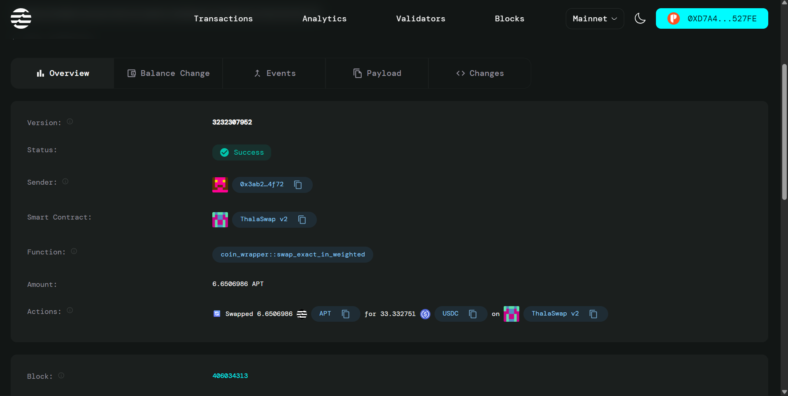

# 🌾 Decentralized Crop Insurance Platform

## Project Description

The Decentralized Crop Insurance Platform is a blockchain-based solution built on the Aptos network that revolutionizes agricultural risk management. This platform enables farmers to purchase insurance policies for their crops and submit claims in case of losses, while providing a transparent, automated, and trustless system for managing agricultural insurance.

The platform consists of a smart contract backend written in Move language and a modern React-based frontend interface. Farmers can browse available insurance templates, purchase policies by paying premiums in APT tokens, and submit claims when needed. Administrators can create new policy templates and manage claims through an intuitive dashboard.

## Project Vision

Our vision is to democratize access to crop insurance globally by:

- **Eliminating Traditional Barriers**: Removing the need for complex paperwork and lengthy approval processes
- **Ensuring Transparency**: Providing a transparent, blockchain-based system where all transactions and policies are publicly verifiable
- **Reducing Costs**: Minimizing administrative overhead through smart contract automation
- **Global Accessibility**: Making crop insurance available to farmers worldwide, regardless of their location or financial institution access
- **Rapid Claims Processing**: Enabling faster claim settlements through automated processes and transparent criteria

We envision a world where every farmer, from smallholder operations to large agricultural enterprises, can protect their livelihood through accessible, fair, and efficient crop insurance.

## Key Features

### 🛡️ **Smart Contract Core**
- **Policy Template Management**: Admins can create customizable insurance templates for different crop types
- **Automated Premium Collection**: Secure premium payments handled through Aptos Coin (APT)
- **Claims Processing System**: Transparent claim submission and approval workflow
- **Multi-Policy Support**: Farmers can hold multiple active policies simultaneously
- **Time-based Validation**: Automatic policy expiration and time-sensitive claims

### 💻 **Frontend Interface**
- **Wallet Integration**: Seamless connection with Petra wallet for secure transactions
- **Intuitive Dashboard**: Separate interfaces for farmers and administrators
- **Policy Marketplace**: Browse and compare available insurance templates
- **Real-time Updates**: Live policy status and claim tracking
- **Responsive Design**: Mobile-friendly interface for accessibility

### 👨‍🌾 **Farmer Features**
- **Browse Insurance Options**: View all available crop insurance templates
- **Purchase Policies**: Buy insurance with APT token payments
- **Policy Management**: Track active, expired, and claimed policies
- **Claim Submission**: Submit claims with reasons and documentation
- **Transaction History**: Complete history of all insurance activities

### 🔧 **Administrator Features**
- **Template Creation**: Create new insurance policy templates with custom parameters
- **Claims Management**: Review, approve, or reject submitted claims
- **Policy Oversight**: Monitor all active policies and system statistics
- **Pool Management**: Track total premiums collected and claims paid

### 🔒 **Security & Trust**
- **Blockchain Security**: Leverages Aptos network's security and finality
- **Admin Access Control**: Role-based permissions for administrative functions
- **Transparent Operations**: All transactions and state changes are publicly auditable
- **Immutable Records**: Policy and claim records cannot be tampered with

## Future Scope

### 📊 **Enhanced Analytics & Reporting**
- **Risk Assessment Models**: AI-powered crop risk evaluation based on historical data
- **Weather Integration**: Oracle integration for automated weather-based claim triggers
- **Yield Prediction**: Machine learning models for crop yield forecasting
- **Market Analytics**: Integration with commodity prices and market data

### 🌐 **Platform Expansion**
- **Multi-Chain Support**: Expansion to other blockchain networks
- **Mobile Application**: Native iOS and Android applications
- **API Development**: RESTful APIs for third-party integrations
- **Multi-Language Support**: Internationalization for global adoption

### 🤖 **Automation & AI**
- **Smart Claim Processing**: Automated claim approval based on predefined criteria
- **Parametric Insurance**: Weather and satellite data-driven automatic payouts
- **Fraud Detection**: AI-powered fraud detection and prevention systems
- **Dynamic Pricing**: Algorithmic premium calculation based on real-time risk factors

### 📱 **Advanced Features**
- **Tokenization**: Fractional ownership of insurance pools through NFTs
- **Governance Token**: Community governance for platform decisions and upgrades
- **Staking Mechanisms**: Yield generation for policy holders and liquidity providers
- **Cross-Platform Integration**: Integration with DeFi protocols for enhanced yields

### 🌍 **Social Impact**
- **Microinsurance**: Ultra-small policy options for smallholder farmers
- **Educational Resources**: Built-in educational content about crop insurance
- **Community Features**: Farmer networks and knowledge sharing platforms
- **Impact Tracking**: Measurement and reporting of social and economic impact

### 🔗 **Ecosystem Development**
- **Partner Integrations**: Collaboration with agricultural cooperatives and NGOs
- **Government Partnerships**: Integration with national agricultural programs
- **Research Collaboration**: Partnerships with agricultural research institutions
- **Developer Ecosystem**: SDKs and tools for third-party developers

## Technology Stack

### **Blockchain & Smart Contracts**
- **Aptos Network**: High-performance, secure blockchain platform
- **Move Language**: Memory-safe smart contract programming language
- **Aptos SDK**: Official TypeScript SDK for blockchain interactions

### **Frontend Development**
- **React 18**: Modern React with hooks and concurrent features
- **TypeScript**: Type-safe JavaScript for enhanced development experience
- **Tailwind CSS**: Utility-first CSS framework for rapid styling
- **Vite**: Fast build tool and development server

### **UI/UX Components**
- **Radix UI**: Accessible, unstyled UI primitives
- **Lucide React**: Beautiful and customizable icon library
- **React Router**: Declarative routing for React applications
- **React Query**: Powerful data synchronization for React

### **Wallet Integration**
- **Aptos Wallet Adapter**: Official wallet connection library
- **Petra Wallet**: Primary wallet integration for Aptos ecosystem

### **Development Tools**
- **ESLint**: Code linting and quality enforcement
- **Prettier**: Code formatting and style consistency
- **PostCSS**: CSS processing with modern features
- **Vercel**: Deployment and hosting platform

## Contract Details
0x43661a8960ff2e47316e1782036be6d44a904f04d9075ed3e7e0797ed68138fa

